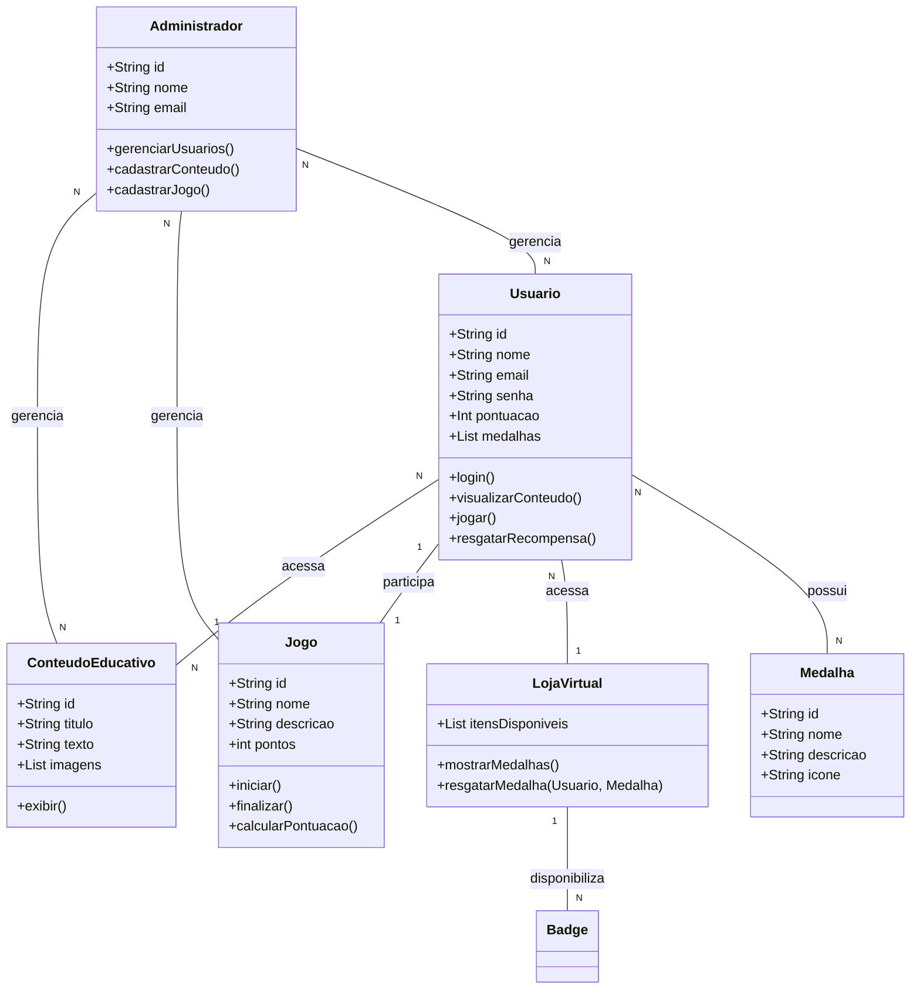

# CyberHero

## Diagrama de classes

```mermaid
classDiagram
    class Usuario {
        +String id
        +String nome
        +String email
        +String senha
        +Int pontuacao
        +List<Medalha> medalhas
        +login()
        +visualizarConteudo()
        +jogar()
        +resgatarRecompensa()
    }

    class ConteudoEducativo {
        +String id
        +String titulo
        +String texto
        +List<String> imagens
        +exibir()
    }

    class Jogo {
        +String id
        +String nome
        +String descricao
        +int pontos
        +iniciar()
        +finalizar()
        +calcularPontuacao()
    }

    class Medalha {
        +String id
        +String nome
        +String descricao
        +String icone
    }

    class LojaVirtual {
        +List<Medalha> itensDisponiveis
        +mostrarMedalhas()
        +resgatarMedalha(Usuario, Medalha)
    }

    class Administrador {
        +String id
        +String nome
        +String email
        +gerenciarUsuarios()
        +cadastrarConteudo()
        +cadastrarJogo()
    }

    Usuario "N" -- "N" ConteudoEducativo : acessa
    Usuario "1" -- "1" Jogo : participa
    Usuario "N" -- "1" LojaVirtual : acessa
    Usuario "N" -- "N" Medalha : possui
    LojaVirtual "1" -- "N" Badge : disponibiliza
    Administrador "N" -- "N" ConteudoEducativo : gerencia
    Administrador "N" -- "1" Jogo : gerencia
    Administrador "N" -- "N" Usuario : gerencia
```
