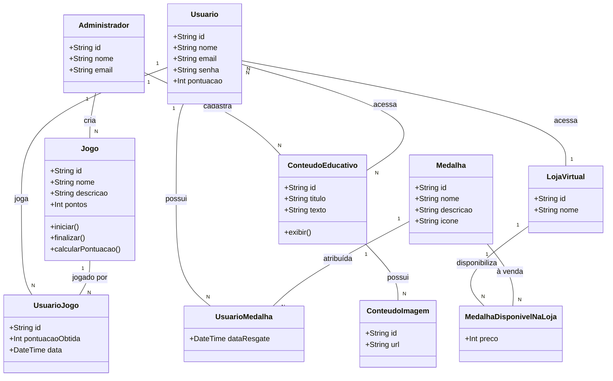

# CyberHero

## Diagrama de classes

```mermaid
classDiagram
    class Usuario {
    +String id
    +String nome
    +String email
    +String senha
    +Int pontuacao
}

    class Administrador {
    +String id
    +String nome
    +String email
}

class ConteudoEducativo {
    +String id
    +String titulo
    +String texto
    +exibir()
}

    class ConteudoImagem {
    +String id
    +String url
}

    class Jogo {
    +String id
    +String nome
    +String descricao
    +Int pontos
    +iniciar()
    +finalizar()
    +calcularPontuacao()
}

    class UsuarioJogo {
    +String id
    +Int pontuacaoObtida
    +DateTime data
}

    class Medalha {
    +String id
    +String nome
    +String descricao
    +String icone
}

class UsuarioMedalha {
    +DateTime dataResgate
}

class LojaVirtual {
    +String id
    +String nome
}

class MedalhaDisponivelNaLoja {
    +Int preco
}

    Usuario "1" -- "N" UsuarioJogo : joga
    Jogo "1" -- "N" UsuarioJogo : jogado por

    Usuario "1" -- "N" UsuarioMedalha : possui
    Medalha "1" -- "N" UsuarioMedalha : atribuída

    Administrador "1" -- "N" Jogo : cria
    Administrador "1" -- "N" ConteudoEducativo : cadastra

    ConteudoEducativo "1" -- "N" ConteudoImagem : possui

    Usuario "N" -- "N" ConteudoEducativo : acessa
    Usuario "N" -- "1" LojaVirtual : acessa

    LojaVirtual "1" -- "N" MedalhaDisponivelNaLoja : disponibiliza
    Medalha "1" -- "N" MedalhaDisponivelNaLoja : à venda
```